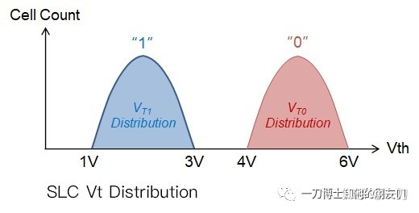
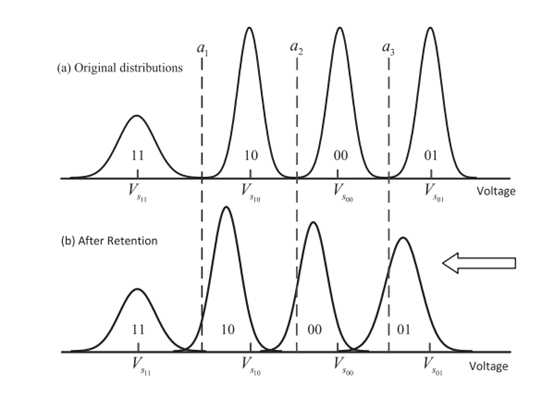
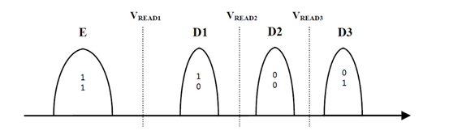
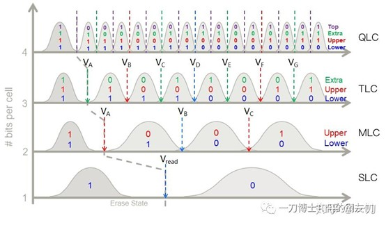

# 关于MLC的一些问题
关于MLC的一些问题
- Vth:（Threshold voltage）门限电压
- Vread:（read threshold）读取门限/读取电压/门限值
- Cell: Cell最小存储单元

1. vth分布图的横轴和纵轴分别表示什么？
   - Vth分布图的横轴表示cell的门限电压值Vth，它是指cell导通所需的电压，会随着cell存储的数据和P/E（program/erase）次数而变化。
   - Vth分布图的纵轴表示cell的数量或者概率密度，它是指在某个Vth值下有多少个cell或者多大的概率。

2. 1个cell为什么可以存储11、10、01、00这四种状态？
   - Flash cell利用浮栅（floating gate）上的电荷来表示不同的数据，浮栅是被绝缘层包裹的金属层，通过注入或抽取电子来改变浮栅上的电荷。
   - 不同的Vth对应不同的数据状态。浮栅上的电荷数量决定了Vth的高低，从而表示不同的数据状态。

3. Vth分布由什么决定？
   - cell存储的bits数目
   - cell的P/E（program/erase）次数
   - cell之间的串扰效应
   - 数据保存时间

4. 当NAND Flash受到P/E循环、数据保持和串扰等因素的影响时，Vth分布会发生变化，读取数据的误码率会增加。
   - 在实际应用中，根据实际的Vth分布来调整Vread值可以减少误码率。
   - ECC（error correction code）可用于检测和纠正读取数据中的错误，并动态调节Vread值。

5. 读取2bit MLC cell的数据需要施加三个读取门限，根据cell是否导通判断存储的数据对应的Vth位于哪个区间，从而确定状态。

   详细信息请参考群空间中的闪存信道资料-MLC Nand Flash读操作。

   请注意，在 Markdown 中插入图片时，您需要提供有效的图片链接。将上述代码替换为适当的图片链接即可。
